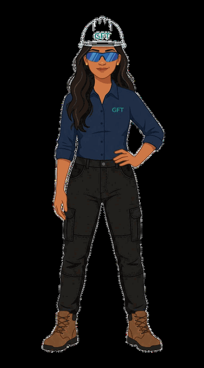

 

*noise analyst by day, founder by night*

 

# Dipseka Timsina

---

I'm not a CS major. I'm an environmental scientist who got curious about everything else. I've done night SCUBA dives to film octopuses, modeled wildfires in Montana, analyzed forests with R, and now I'm building software for communities that mainstream tech left behind.

I use GitHub to document the work, not perform it.

---

### currently building

---

---

---

&nbsp;

 

*building things that matter, one unexpected intersection at a time.*

